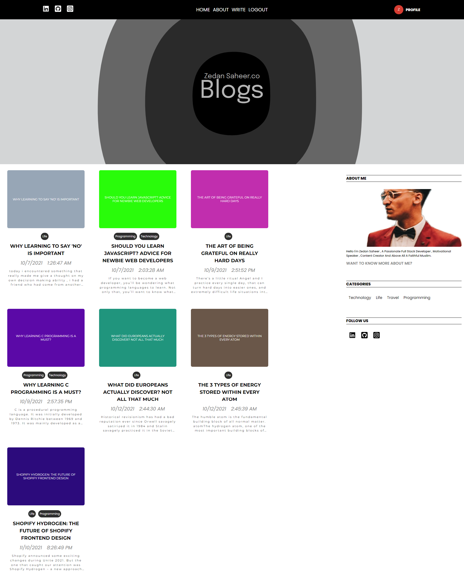

# MERN STACK BLOG PROJECT

this is a fully functional open source blog project built with MERN stack and have all the necessary modern syntax and dynamic routing as well as a fully functional responsive blog , there is a server repository containing all the CRUD functions and database connection to this application.

